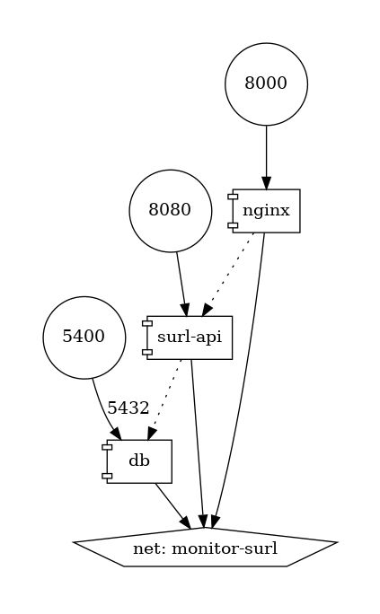
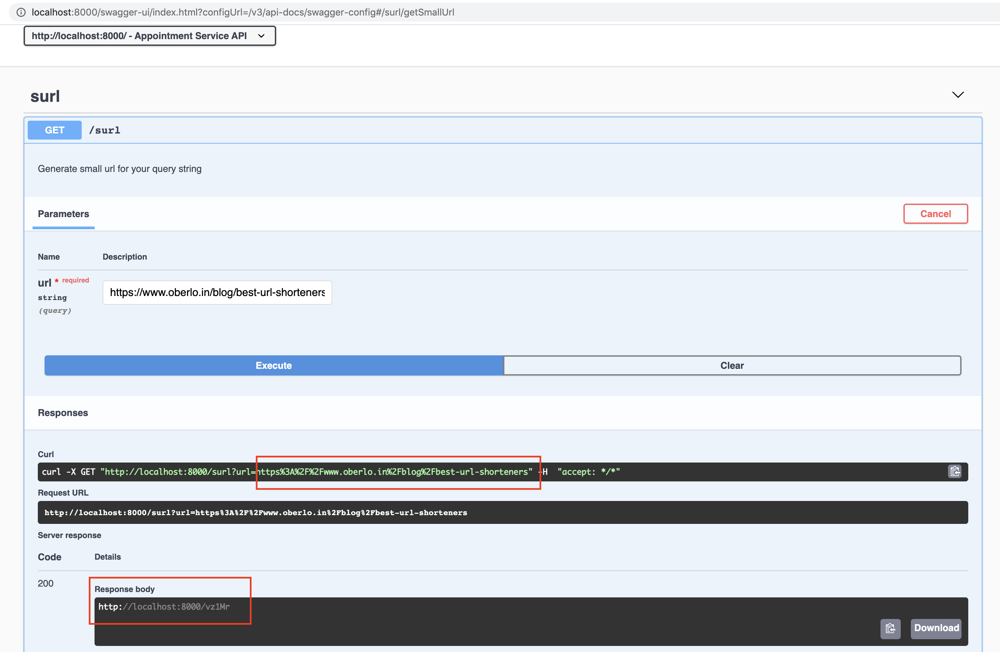

<h1>Small Url Utility (SURL)</h1>

A basic utility to generate small url

Generated small urls are persisted in the backend and can be used for redirection to original URLs. 
The generated URL will be 5 character long with base 62. Max distinct records that can be generated: 916132832 (62^5)

Example URL generated is: <u><i>http://localhost:8000/vz1Mr</i></u>

Application is running over Docker container. Nginx is used for routing user-requests.

<h2>Design</h2>

<h3>Framework Support</h3>

1. Springboot
2. Springboot JPA
3. Postgres
4. Nginx
5. Docker

<h3>Container Diagram</h3>

<code>docker run --rm -it --name dcv -v $(pwd):/input pmsipilot/docker-compose-viz render -m image docker-compose.yml -o
images/arch/container-diag.png --no-volumes --force</code>

<h2>Openapi Documentation</h2>

[Swagger URL](http://localhost:8000/swagger-ui/index.html?configUrl=/v3/api-docs/swagger-config#)

<h2>Todo List</h2>

<ul>
<li>hash collisions are not handled right now (If 2 URLs  produce same hash, 2nd one is lost)</li>
<li>secure http implementation</li>
<li>URL validation</li>
</ul>
 
